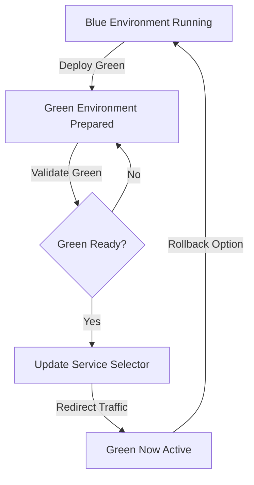

# Blue-Green Deployment Project

A complete DevOps implementation demonstrating containerization, orchestration, and zero-downtime blue-green deployment strategy using Docker, Docker Compose, and Kubernetes (Minikube).

## 🎯 Project Overview

This project implements a user registration application with:

- **Backend**: Express.js REST API with MongoDB
- **Frontend Blue**: Basic HTML/CSS registration form
- **Frontend Green**: Enhanced multi-step registration form with Font Awesome icons
- **Blue-Green Deployment**: Zero-downtime switching between two production environments

## 📋 Quick Navigation

- **🚀 Getting Started**: [QUICK_START_LOCAL.md](./QUICK_START_LOCAL.md) - Local Docker Compose setup
- **☸️ Kubernetes Deployment**: [QUICK_START_K8S.md](./QUICK_START_K8S.md) - Minikube deployment
- **📖 Complete Guide**: [DEPLOYMENT_GUIDE.md](./DEPLOYMENT_GUIDE.md) - Comprehensive documentation
- **🔧 Implementation Details**: [IMPLEMENTATION.md](./IMPLEMENTATION.md) - Technical architecture
- **📑 File Structure**: [FILES.md](./FILES.md) - Complete file listing

## ✅ Prerequisites

### Required Tools

```bash
# Check if installed
docker --version        # v20.10+
docker-compose --version # v1.29+
minikube version        # v1.20+
kubectl version         # v1.20+
node --version          # v16+
```

### Installation Links

| Tool | Windows | macOS | Linux |
|------|---------|-------|-------|
| Docker Desktop | [Download](https://www.docker.com/products/docker-desktop) | [Download](https://www.docker.com/products/docker-desktop) | [Install](https://docs.docker.com/install/linux/docker-ce/) |
| Minikube | [MSI](https://github.com/kubernetes/minikube/releases) | [Homebrew](https://minikube.sigs.k8s.io/docs/start/) | [Linux](https://minikube.sigs.k8s.io/docs/start/) |
| kubectl | [Installer](https://kubernetes.io/docs/tasks/tools/install-kubectl-windows/) | [Homebrew](https://kubernetes.io/docs/tasks/tools/install-kubectl-macos/) | [Linux](https://kubernetes.io/docs/tasks/tools/install-kubectl-linux/) |
| Git | [Git Bash](https://git-scm.com/download/win) | [Homebrew](https://git-scm.com/download/mac) | [Linux](https://git-scm.com/download/linux) |
| Node.js | [MSI](https://nodejs.org/) | [Homebrew](https://nodejs.org/) | [Linux](https://nodejs.org/) |

## 🏃 Quick Start

### Option 1: Local Development (2 minutes)

```bash
# Navigate to project
cd Blue-green-Deployment

# Start all services
docker-compose up --build

# Access applications
# Backend: http://localhost:5000
# Blue Frontend: http://localhost:3100
# Green Frontend: http://localhost:3200
```

See [QUICK_START_LOCAL.md](./QUICK_START_LOCAL.md) for detailed instructions.

### Option 2: Kubernetes Deployment (5-10 minutes)

**Linux/macOS/WSL**:
```bash
chmod +x scripts/deploy-to-k8s.sh
bash scripts/deploy-to-k8s.sh
```

**Windows (PowerShell)**:
```powershell
cd scripts
.\deploy-to-k8s.bat
```

See [QUICK_START_K8S.md](./QUICK_START_K8S.md) for detailed instructions.

## 📂 Project Structure

```
Blue-green-Deployment/
├── 📄 Documentation
│   ├── README.md                 ← You are here
│   ├── QUICK_START_LOCAL.md      ← Start here for local
│   ├── QUICK_START_K8S.md        ← Start here for K8s
│   ├── DEPLOYMENT_GUIDE.md       ← Complete guide
│   ├── IMPLEMENTATION.md         ← Technical details
│   └── FILES.md                  ← File reference
│
├── 🔧 Application Code
│   ├── backend/                  ← Express REST API
│   │   ├── Dockerfile            ← Multi-stage build
│   │   ├── server.js
│   │   ├── package.json
│   │   ├── .env
│   │   ├── models/user.js
│   │   └── routes/users.js
│   │
│   ├── frontend-blue/            ← Basic UI
│   │   ├── Dockerfile
│   │   ├── server.js
│   │   ├── package.json
│   │   ├── .env
│   │   └── public/
│   │       ├── index.html
│   │       └── styles.css
│   │
│   └── frontend-green/           ← Enhanced UI
│       ├── Dockerfile
│       ├── server.js
│       ├── package.json
│       ├── .env
│       └── public/
│           ├── index.html
│           ├── app.js
│           └── styles.css
│
├── 🐳 Docker
│   └── docker-compose.yml        ← Local orchestration
│
├── ☸️ Kubernetes
│   └── k8s/
│       ├── namespace.yaml
│       ├── mongo-deployment.yaml
│       ├── backend-deployment.yaml
│       ├── frontend-blue-deployment.yaml
│       ├── frontend-green-deployment.yaml
│       ├── frontend-configmap.yaml
│       ├── backend-configmap.yaml
│       └── ingress.yaml
│
└── 📜 Scripts
    └── scripts/
        ├── deploy-to-k8s.sh      ← Linux/macOS deployment
        ├── deploy-to-k8s.bat     ← Windows deployment
        ├── blue-green-switch.sh  ← Linux/macOS switching
        └── blue-green-switch.bat ← Windows switching
```

## 🛠 Part 1: Local Deployment

### Automated Setup (Recommended)

```bash
# Navigate to project
cd Blue-green-Deployment

# Start with Docker Compose
docker-compose up --build

# Wait for all services to be healthy
# You'll see:
# ✓ MongoDB connected
# ✓ Backend running on port 5000
# ✓ Frontend Blue on port 3100
# ✓ Frontend Green on port 3200
```

### Manual Setup

```bash
# Backend
cd backend
npm install
npm start

# Frontend Blue (new terminal)
cd frontend-blue
npm install
npm start

# Frontend Green (new terminal)
cd frontend-green
npm install
npm start

# MongoDB (Docker)
docker run -d -p 27017:27017 \
  -e MONGO_INITDB_ROOT_USERNAME=admin \
  -e MONGO_INITDB_ROOT_PASSWORD=password \
  mongo:7.0-alpine
```

### Verify Services

```bash
# Backend health
curl http://localhost:5000/health

# Blue frontend
curl http://localhost:3100/health

# Green frontend
curl http://localhost:3200/health

# List users
curl http://localhost:5000/api/users
```

## 🐳 Part 2: Containerization

### Docker Images

All images use optimized multi-stage builds:

```bash
# Build images
docker build -t registration-backend:latest ./backend
docker build -t registration-frontend-blue:latest ./frontend-blue
docker build -t registration-frontend-green:latest ./frontend-green

# Verify
docker images | grep registration

# Run with Docker Compose
docker-compose up -d --build

# Check status
docker-compose ps

# View logs
docker-compose logs -f
```

### Image Sizes

| Image | Size | Details |
|-------|------|---------|
| Backend | ~70MB | Multi-stage, Alpine |
| Frontend Blue | ~65MB | Multi-stage, Alpine |
| Frontend Green | ~70MB | Multi-stage, Alpine |
| MongoDB | ~45MB | Official Alpine |

## ☸️ Part 3: Kubernetes Deployment

### Automated Deployment

**Linux/macOS/WSL**:
```bash
chmod +x scripts/deploy-to-k8s.sh
bash scripts/deploy-to-k8s.sh
```

**Windows (PowerShell)**:
```powershell
cd scripts
.\deploy-to-k8s.bat
```

### Manual Deployment

```bash
# 1. Start Minikube
minikube start --cpus=4 --memory=4096

# 2. Enable ingress
minikube addons enable ingress

# 3. Set up Docker environment
eval $(minikube docker-env)  # Linux/macOS
# or run: minikube docker-env (Windows) and copy commands

# 4. Build images
docker build -t registration-backend:latest ./backend
docker build -t registration-frontend-blue:latest ./frontend-blue
docker build -t registration-frontend-green:latest ./frontend-green

# 5. Deploy
kubectl apply -f k8s/namespace.yaml
kubectl apply -f k8s/mongo-deployment.yaml
kubectl apply -f k8s/backend-deployment.yaml
kubectl apply -f k8s/frontend-blue-deployment.yaml
kubectl apply -f k8s/frontend-green-deployment.yaml
kubectl apply -f k8s/ingress.yaml

# 6. Check status
kubectl get pods -n registration-app
```

### Verify Deployment

```bash
# Check all resources
kubectl get all -n registration-app

# Check pods
kubectl get pods -n registration-app

# Check services
kubectl get services -n registration-app

# Check ingress
kubectl get ingress -n registration-app

# View pod logs
kubectl logs -n registration-app -l app=backend
```

## 🔄 Part 4: Blue-Green Deployment

### What is Blue-Green Deployment?

A deployment strategy that runs two identical production environments:
- **Blue**: Currently active (basic UI)
- **Green**: New version (enhanced UI)

Switch traffic instantly between them with zero downtime.

### Using the Switch Script

**Linux/macOS**:
```bash
# View status
bash scripts/blue-green-switch.sh status

# Switch to blue (basic UI)
bash scripts/blue-green-switch.sh blue

# Switch to green (enhanced UI)
bash scripts/blue-green-switch.sh green
```

**Windows**:
```cmd
# View status
scripts\blue-green-switch.bat status

# Switch to blue
scripts\blue-green-switch.bat blue

# Switch to green
scripts\blue-green-switch.bat green
```

### Manual Switching

```bash
# Switch to green
kubectl patch service frontend-lb -n registration-app \
  -p '{"spec":{"selector":{"deployment":"green"}}}'

# Verify change
kubectl get service frontend-lb -n registration-app -o jsonpath='{.spec.selector}'
```

### Testing the Switch

1. **Access Blue (Basic UI)**:
   ```bash
   bash scripts/blue-green-switch.sh blue
   # Visit http://registration.local
   # Should see: "Version: Basic UI"
   ```

2. **Access Green (Enhanced UI)**:
   ```bash
   bash scripts/blue-green-switch.sh green
   # Visit http://registration.local
   # Should see: "Version: Enhanced UI" with multi-step form
   ```

## 📊 Architecture

```
┌─────────────────────────────────────────────────┐
│         Kubernetes / Docker Compose             │
├─────────────────────────────────────────────────┤
│                                                 │
│  ┌──────────────────────────────────────────┐  │
│  │         Ingress / Load Balancer         │  │
│  └────────────┬─────────────────────────────┘  │
│               │ (Route traffic)                │
│      ┌────────┴────────┐                       │
│      │                 │                       │
│   ┌──▼──┐           ┌──▼──┐                   │
│   │Blue │           │Green│                   │
│   │(x2) │           │(x2) │                   │
│   └──┬──┘           └──┬──┘                   │
│      │                 │                       │
│      └────────┬────────┘                       │
│               │ (Route to API)                 │
│          ┌────▼─────┐                         │
│          │ Backend  │                         │
│          │  (x3)    │                         │
│          └────┬─────┘                         │
│               │ (Query)                       │
│          ┌────▼─────┐                         │
│          │ MongoDB  │                         │
│          └──────────┘                         │
└─────────────────────────────────────────────────┘
```

## 🧪 Testing

### Test Backend API

```bash
# Get health
curl http://localhost:5000/health

# Register user
curl -X POST http://localhost:5000/api/users \
  -H "Content-Type: application/json" \
  -d '{
    "name": "John",
    "surname": "Doe",
    "dob": "1990-01-01",
    "job": "Developer",
    "place": "New York",
    "interests": ["Coding"],
    "knownLanguages": ["English"],
    "registeredFrom": "basic"
  }'

# Get all users
curl http://localhost:5000/api/users

# Get statistics
curl http://localhost:5000/api/users/count
```

### Test Frontends

1. **Blue Frontend**: http://localhost:3100
   - Fill out single-page form
   - Submit registration
   - See success message

2. **Green Frontend**: http://localhost:3200
   - Fill out 3-step form
   - Progress through steps
   - Submit registration
   - See success message

## 🐛 Troubleshooting

### Common Issues

| Issue | Solution |
|-------|----------|
| Port already in use | Change port in `.env` or `docker-compose.yml` |
| MongoDB connection failed | Wait for MongoDB to start (first run takes longer) |
| Pods not starting | Check logs: `kubectl logs <pod-name> -n registration-app` |
| Services not accessible | Verify ingress: `kubectl describe ingress -n registration-app` |
| Blue-green switch not working | Check labels: `kubectl get pods -n registration-app --show-labels` |

See [DEPLOYMENT_GUIDE.md](./DEPLOYMENT_GUIDE.md#troubleshooting) for detailed troubleshooting.

## 📚 Documentation

| Document | Purpose |
|----------|---------|
| [QUICK_START_LOCAL.md](./QUICK_START_LOCAL.md) | 2-minute Docker Compose setup |
| [QUICK_START_K8S.md](./QUICK_START_K8S.md) | 5-10 minute Kubernetes setup |
| [DEPLOYMENT_GUIDE.md](./DEPLOYMENT_GUIDE.md) | Comprehensive deployment guide |
| [IMPLEMENTATION.md](./IMPLEMENTATION.md) | Technical architecture details |
| [FILES.md](./FILES.md) | Complete file reference |

## 🎓 Learning Outcomes

Through this project you'll learn:

- ✅ **Docker**: Multi-stage builds, health checks, image optimization
- ✅ **Docker Compose**: Service orchestration, networking, volumes
- ✅ **Kubernetes**: Deployments, Services, ConfigMaps, Ingress
- ✅ **Blue-Green Deployment**: Zero-downtime switching strategy
- ✅ **DevOps**: Complete deployment pipeline
- ✅ **Monitoring**: Health checks and logging
- ✅ **Security**: Non-root containers, resource limits
- ✅ **Best Practices**: IaC, automation, scalability

## 🚀 Production Deployment

For production beyond Minikube:

1. **Use managed Kubernetes**:
   - AWS EKS
   - Google GKE
   - Azure AKS
   - DigitalOcean Kubernetes

2. **Use container registries**:
   - Docker Hub
   - Amazon ECR
   - Google Container Registry
   - Azure Container Registry

3. **Add monitoring & logging**:
   - Prometheus + Grafana
   - ELK Stack
   - Jaeger for tracing

4. **Implement security**:
   - SSL/TLS with cert-manager
   - RBAC for access control
   - Network policies
   - Pod security policies

## 📋 Checklist

- [ ] All prerequisites installed
- [ ] Docker Compose services running
- [ ] Minikube cluster started
- [ ] All Kubernetes resources deployed
- [ ] Pods in "Running" state
- [ ] Services accessible via ingress
- [ ] Blue-green switching works
- [ ] Data persists after restart
- [ ] Logs are accessible
- [ ] Health checks passing

## 🆘 Support

For issues:

1. Check [Troubleshooting](./DEPLOYMENT_GUIDE.md#troubleshooting) section
2. Review [IMPLEMENTATION.md](./IMPLEMENTATION.md)
3. Check logs: `docker logs` or `kubectl logs`
4. Describe resources: `kubectl describe`

## 📝 Notes

- All services run on non-root users
- Health checks configured at all levels
- Resource limits prevent resource exhaustion
- Persistent volumes for data durability
- Multi-replica deployments for availability
- Blue-green strategy for safe updates

## 📄 License

This project is provided as-is for educational purposes
# Apply all manifests
kubectl apply -f k8s/

# Verify deployments
kubectl get deployments
kubectl get services
kubectl get pods
```

### 7. Blue-Green Switching

#### Switch Traffic Methods

1. Basic Patch Command
```bash
# Switch to Green
kubectl patch service frontend-service -p '{"spec":{"selector":{"version":"green"}}}'

# Switch back to Blue
kubectl patch service frontend-service -p '{"spec":{"selector":{"version":"blue"}}}'
```

2. Detailed Patch Command
```bash
kubectl patch service frontend-service --type='merge' -p '{
  "spec":{
    "selector":{
      "app":"frontend",
      "version":"green"
    }
  }
}'
```

### 8. Verification
- Check service endpoints
- Verify traffic routing
- Monitor application logs

### Troubleshooting
- `kubectl get pods` - Check pod status
- `kubectl logs <pod-name>` - View logs
- `kubectl describe service frontend-service` - Service details

### Cleanup
```bash
# Remove deployments
kubectl delete -f k8s/

# Stop Minikube
minikube stop
```

## Blue-Green Deployment Flow Chart



### Flow Explanation
1. Blue environment is initial production
2. Green environment deployed alongside
3. Validate green environment 
4. Update service selector
5. Redirect traffic to green
6. Blue remains as rollback option

## Best Practices
- Implement health checks
- Use resource limits
- Configure monitoring
- Validate before switching
- Maintain rollback strategy


## License
This project is licensed under the MIT License
